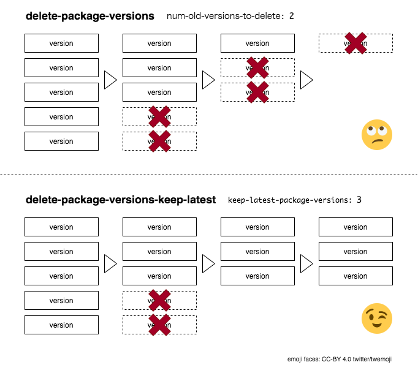

# delete-package-versions-keep-latest

[delete-package-versions](https://github.com/actions/delete-package-versions) will delete the specified number of old packages. But in this action, you can specify the number of latest packages you want to keep, and only remove older packages.

<p align="center">
  
</p>

## Getting started

```yaml
steps:
- uses: windyakin/delete-package-versions-keep-latest@v1
  with:
    owner: windyakin
    repo: package-repository
    package-name: package
    keep-latest-package-versions: 10
```

## Variables

Name | Default | Description
-- | -- | -- |
`owner` | (From [context](https://docs.github.com/en/actions/reference/context-and-expression-syntax-for-github-actions#github-context)) | Package linked repository owner
`repo` | (From [context](https://docs.github.com/en/actions/reference/context-and-expression-syntax-for-github-actions#github-context)) | Package linked repository name
`package-name` | (required) | Package name
`keep-latest-package-versions` | 10 | The number of versions to keep

## License

[MIT License](LICENSE)

## Author

@windyakin
